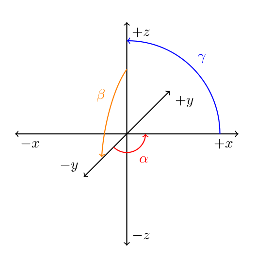

<!-- Badges -->
[](https://ewpratten.retrylife.ca/libepn) 
---

LibEPN (*Easy Pose Notation*) is a Java library designed to provide an easy-to-use interface for 3D position and orientation. The library is heavily dependant on [Quaternions](https://en.wikipedia.org/wiki/Quaternion), and makes use of the following dependencies:

 - [Apache Commons Math](https://commons.apache.org/proper/commons-math/)
 - [Efficient Java Matrix Library](http://ejml.org)

I use this library in various personal and school projects relating to pose estimation, robotics, and computer vision. 

## Using in your project

**Step 1.** Add the RetryLife maven server to your `build.gradle` file:

```groovy
repositories {
    maven { 
        name 'retrylife-release'
        url 'https://release.maven.retrylife.ca/' 
    }
}
```

**Step 2.** Add this library as a dependency:

```groovy
dependencies {
    implementation 'ca.retrylife:easy-pose-notation:1.+'
    implementation 'ca.retrylife:easy-pose-notation:1.+:sources'
    implementation 'ca.retrylife:easy-pose-notation:1.+:javadoc'
}
```

## Coordinates

The following should be noted when working with coordinates:

 - `alpha`, `beta`, and `gamma` refer respectively to the `Z`, `X` and `Y` axes of rotation.
 - The coordinate system assumes that:
   - If you are at `(x: 0, y: 1, z: 0)` facing `(0,0,0)`, the `Y` axis will be coming "towards" you, `X` will be increasing to your left, and `Z` will be increasing towards the sky.
 - All angles will increase to the left around any axis assuming you are in line with the axis, looking at `(0,0,0)`
 - All coordinate and angle systems follow that of Google's device orientation specification, and the world frame coordinate system used by MIT's Drake.



## Basic usage

The following is a basic usage example. See the [JavaDoc](https://ewpratten.retrylife.ca/libepn) for full API reference.

```java
// Create a pose at (10,0,0) rotated around the Z axis to the left by 45 degrees
Pose p = new Pose(
    new SimpleMatrix(new double[][]{{10,0,0}}), 
    QuaternionUtil.quaternionFromEulerAngles(Math.toRadians(45), 0, 0)
);

// Print the pose's quaternion
System.out.println(p.getRotation());

// Print the pose's rotation as euler angles
System.out.println(p.getEulerRotation());

// Print the pose's position
System.out.println(p.getPosition());

// Print the pose's "surface normal
System.out.println(p.getNormal());

```

## EPN4FRC

This library also contains a sub-library called EPN4FRC. This is a small binding between LibEPN and [WPILib](https://github.com/wpilibsuite/allwpilib/)'s [Pose2d](https://first.wpi.edu/FRC/roborio/release/docs/java/edu/wpi/first/wpilibj/geometry/Pose2d.html) coordinate system for the *FIRST* Robotics Competition. EPN4FRC in-source documentation can be found [here](https://github.com/Ewpratten/libepn/blob/master/epn4frc/src/main/java/ca/retrylife/libepn/epn4frc/EPN4FRC.java).

## Credits

This library was heavily supported by the following sources:
 - Wikipedia: [Quaternions](https://en.wikipedia.org/wiki/Quaternion)
 - Wikipedia: [Conversion between quaternions and Euler angles](https://en.wikipedia.org/wiki/Conversion_between_quaternions_and_Euler_angles)
 - 3blue1brown: [Visualizing Quaternions](https://www.youtube.com/watch?v=d4EgbgTm0Bg)
 - 3blue1brown: [Quaternions and 3d rotation, explained interactively](https://www.youtube.com/watch?v=zjMuIxRvygQ)
